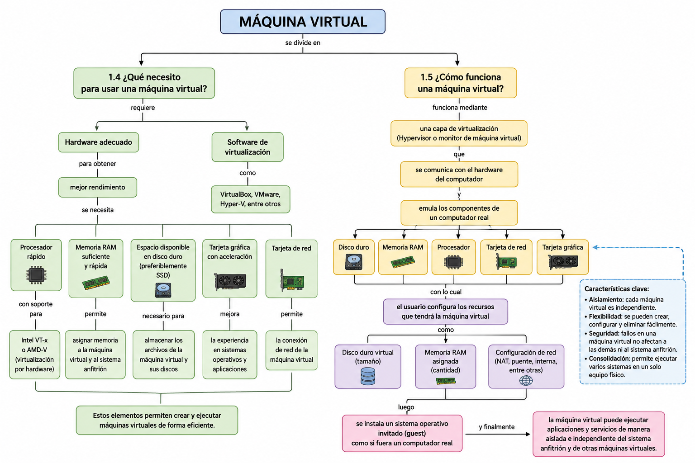
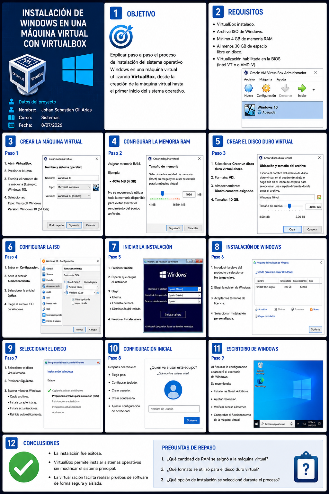

# 1. Máquinas Virtuales
## ¿Qué es una máquina virtual?

A. Un dispositivo físico para almacenar información.

B. Un software que simula una computadora y permite ejecutar otros sistemas operativos.

C. Un sistema operativo exclusivo para servidores.

D. Un programa para crear redes inalámbricas.

#### RTA : Un software que simula una computadora y permite ejecutar otros sistemas operativos. ✅
##

## 2. ¿Cuál es uno de los usos más comunes de una máquina virtual?

A. Reparar discos duros dañados.

B. Diseñar páginas web.

C. Probar sistemas operativos sin instalarlos directamente. 

D. Aumentar la velocidad del procesador.

#### RTA : Probar sistemas operativos sin instalarlos directamente. ✅

##
## 3. ¿Cuáles son las dos principales categorías de máquinas virtuales?

A. Locales y remotas.

B. Gratuitas y comerciales.

C. De sistema y de proceso. 

D. Físicas y digitales.

#### RTA : De sistema y de proceso. ✅
##

## 4. ¿Cómo se llama el software encargado de administrar la virtualización?

A. Kernel.

B. BIOS.

C. Hypervisor o monitor de máquina virtual. 

D. Firewall.

### RTA : Hypervisor o monitor de máquina virtual. ✅
## 

## 5. ¿Qué caracteriza a una máquina virtual de proceso?
A. Ejecuta varios sistemas operativos al mismo tiempo.

B. Se ejecuta como un proceso dentro de un sistema operativo y soporta un solo proceso. 

C. Reemplaza completamente al sistema operativo.

D. Solo funciona en servidores.

### RTA : Se ejecuta como un proceso dentro de un sistema operativo y soporta un solo proceso. ✅
##

## 6. ¿Cuál es una ventaja de la virtualización en servidores?

A. Elimina la necesidad de memoria RAM.

B. Reduce costos al consolidar varios servicios en una sola máquina física. 

C. Duplica automáticamente el almacenamiento.

D. Impide el uso de varios sistemas operativos.

### RTA : Reduce costos al consolidar varios servicios en una sola máquina física. ✅
##

## 7. ¿Qué sucede si una máquina virtual deja de funcionar?
A. Todas las demás máquinas virtuales dejan de funcionar.

B. Se daña el hardware del equipo.

C. Las demás continúan funcionando de forma independiente. 

D. El sistema operativo anfitrión se elimina

### RTA : Las demás continúan funcionando de forma independiente. ✅
##

## 8. ¿Cuál de los siguientes componentes puede ser virtualizado?

A. Disco duro.

B. Memoria RAM.

C. Tarjeta de red.

D. Todos los anteriores. 

### RTA : Todos los anteriores. ✅ 
##
## 9. ¿Cuál de las siguientes es una técnica de virtualización?
 A. Virtualización completa del hardware. 

B. Fragmentación de disco.

C. Compresión de archivos.

D. Encriptación de datos.
### RTA : Virtualización completa del hardware. ✅
##
## 10. ¿Qué tipo de monitor se ejecuta directamente sobre el hardware?
A. Tipo II.

B. Tipo I. 

C. Tipo III.

D. Tipo Virtual.

### RTA : Tipo I. ✅
##
## 11. ¿Qué se necesita para obtener un mejor rendimiento al usar máquinas virtuales?
A. Procesador rápido con soporte para virtualización.

B. Memoria RAM suficiente.

C. Espacio disponible en disco.

D. Todas las anteriores. 

### RTA : Todas las anteriores. ✅
##
## 12. ¿Qué componente también mejora la experiencia de virtualización?
A. Tarjeta gráfica con aceleración. 

B. Unidad de disquete.

C. Impresora.

D. Módem telefónico.

### RTA : Tarjeta gráfica con aceleración. ✅
##
## 13. ¿Qué se configura al crear una máquina virtual?
A. Memoria RAM.

B. Disco duro virtual.

C. Configuración de red.

D. Todas las anteriores. 

### RTA :  Todas las anteriores. ✅
##
## 14. ¿Cuál es una desventaja de las máquinas virtuales?
A. Requieren menos recursos.

B. Ejecutan los programas más lentamente que un sistema instalado directamente.

C. No pueden ejecutar sistemas operativos.

D. No permiten instalar programas.
### RTA : Ejecutan los programas más lentamente que un sistema instalado directamente. ✅
##
## 15. ¿Para qué pueden utilizarse las máquinas virtuales como "sandbox"?
A. Para acelerar Internet.

B. Para ejecutar aplicaciones sospechosas en un entorno seguro. ✅

C. Para reparar discos duros.

D. Para actualizar la BIOS.
### RTA : Para ejecutar aplicaciones sospechosas en un entorno seguro. ✅
##
## 16. ¿Cuál de los siguientes programas es un software de virtualización?
A. VirtualBox. 

B. Photoshop.

C. LibreOffice.

D. VLC.
### RTA : VirtualBox. ✅
##
## 17. ¿Qué empresa desarrolla VirtualBox?
A. Microsoft.

B. Oracle. 

C. Apple.

D. Intel.
### RTA : Oracle. ✅
##
## 18. ¿Qué comando permite verificar si el procesador soporta virtualización por hardware en Linux?

A. lsusb

B. egrep "vmx|svm" /proc/cpuinfo 

C. ping localhost

D. ipconfig
### RTA :  egrep "vmx|svm" /proc/cpuinfo ✅
##
## 19. ¿Qué tecnología permite virtualizar hardware en procesadores Intel?

A. Intel VTx. 

B. HyperThreading.

C. Turbo Boost.

D. Quick Sync.

### RTA : Intel VTx. ✅
##
## 20. ¿Cuál es una ventaja importante de las máquinas virtuales en empresas?

A. Reducen el consumo de energía y el número de equipos físicos. 

B. Eliminan la necesidad de licencias.

C. Aumentan el tamaño del disco duro.

D. Sustituyen completamente el hardware.
### RTA : educen el consumo de energía y el número de equipos físicos. ✅

##
## 
